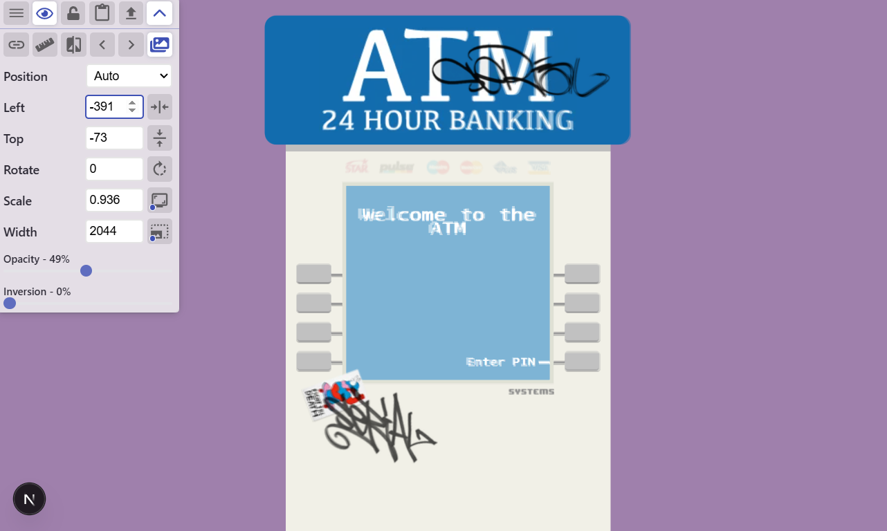

# ATM Homework Assignment

This project was developed using Next.js, Tailwind CSS, TypeScript and, of course, React. You can view the deployed version of this project at <https://kmarple1.github.io/frontend_hw_project/>. Please see the [Notes on Design](#notes-on-design) section below for notes on things that go beyond the project requirements, as well as what I'd do if I had more time.

## Running the Project Locally

To run the project locally, first install the dependencies using your chosen package manager and then run the development server:

```bash
npm run dev
# or
yarn dev
# or
pnpm dev
# or
bun dev
```

Open [http://localhost:3000](http://localhost:3000) with your browser to see the result.

Sample data can be found in `app/data.json`. Valid PINs are: 1234, 0000, 4321, 1111, 5555 and 9999.

NOTE: When inputting values, there is an input field in the middle of the screen. It should autofocus, but it might be invisible if it doesn't.

## Notes on Design

In addition to the project requirements, I included what I consider my standard project setup:

- Linting for both code and styles, with a .editorconfig file to assist compliant editors
- Pre-commit checks to enforce both linting and commit message formatting
- NPM and NVM configs

I also went to particular efforts to achieve a near-pixel-perfect implementation and added a simple CI/CD pipeline using Github Actions for automated deployment.

### Pixel Perfection

I strive to match the designs I'm given down to the pixel. In this case, there are only two remaining issues. First, I wasn't able to figure out which font you were using, so there are minor differences there. Second, there's a little bit of stretching in the sign. The latter is actually a design choice, as the sizes for my project were chosen to avoid stretching or scaling the provided images, but it would be easy enough to fix. Below are overlays of my project with the provided mock images:

Overlay with Mock_1.png:


Overlay with Mock_2.png


### If Only There was More Time

This project was a lot of fun, and unexpectedly challenging in some areas, but there wasn't quite time to do everything I would have liked to. Here's what I'd add if I had more time:

- Unit testing
- Full responsiveness
- Better input (specifically, I'd have liked to hide the input field completely and give a constant, blinking cursor like you see on older ATMs)
- Bells and Whistles (there's a lot you could do with this, like card input, a functional keypad for input, etc.)
